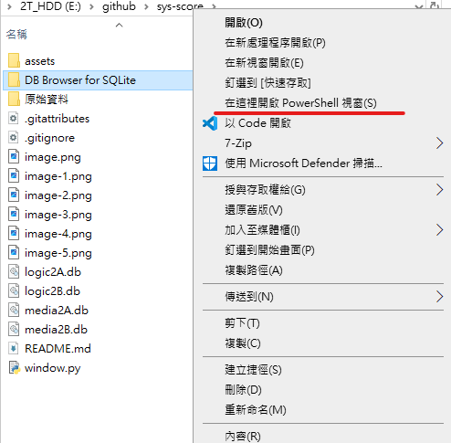

python 3.11  
numpy-1.26.4 
pandas-2.2.1  
db-sqlite3 3-0.0.1  

1.使用時 在資料夾內shift+右鍵 -> 用powersell開啟 
 
    輸入 python window.py執行
2.輸入學號,課程,分數異動,以及備註(分數目前只接受加減乘除) 
>    logic2A資料庫內 有測試用資料 
>    學號       姓名    分數
>    109021071  測試用  100 

3.檢查資料內容請點開
    DB Browser for SQLite資料夾  ->  DB Browser for SQLite.exe
 
3.選擇資料庫 
左方按鍵 打開資料庫 
    選擇課程的資料庫 (遊戲邏輯 -> logic  互動媒體 -> media) 
    EX: "media2A.db"為互動媒體2A資料庫 
 
點選下方Browse Data 
 
    點選下拉式選單 
 
5.資料表查看 
score -> 學號 姓名 分數 
history -> 學號 更新內容 備註 當下時間
